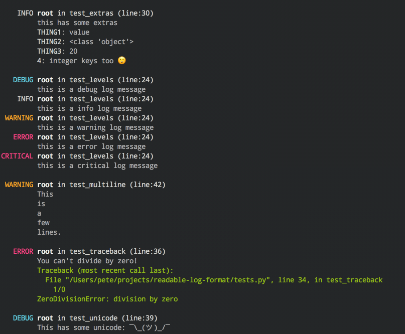

Pretty logs for local development.

Provides the class ``readable_log_formatter.ReadableFormatter`` to be used
with Python's logging:

.. code-block:: python

        import logging
        from readable_log_formatter import ReadableFormatter

        log = logging.getLogger()
        log.setLevel(logging.INFO)
        hndl = logging.StreamHandler()
        hndl.setFormatter(ReadableFormatter())
        log.addHandler(hndl)

